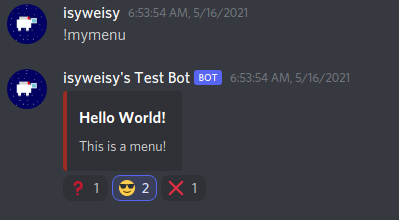

# DiscordEasyMenus


## Project Overview
A library to easily make reaction based menus using discord.py.
This library handles the creation and sending of a menu in the form of a message
sent through a Discord bot, and automatically calls the specified functions when
users react with the specified emojis.

## Installation
First, install discord.py as normal.

```commandline
# Linux/macOS
python3 -m pip install -U "discord.py[voice]"

# Windows
py -3 -m pip install -U discord.py[voice]
```

Then, clone this project into your project.

```commandline
git clone https://github.com/isyweisy/DiscordEasyMenus.git
```

Or if you already have git initialised, use submodule.

```commandline
git submodule add https://github.com/isyweisy/DiscordEasyMenus.git
```

You should now be ready to import easy menus into your project!

## Usage
Import everything you need, including discord.py and DiscordEasyMenus.

```python
import discord, DiscordEasyMenus
```

Create your bot as normal, but use DiscordEasyMenus.Bot as your
baseclass instead. This library is designed so that discord.py can mostly be
used as normal, so make sure you know how to use that first!

```python
# Should you override on_raw_reaction_add, on_raw_reaction_remove or close
# you will need to make a super call for this library to work correctly.
class MyBot(DiscordEasyMenus.Bot):
    async def on_ready(self):
        print(f"Logged in as {self.user.name}#{self.user.discriminator}")

bot = MyBot(command_prefix="!")
```

Define what will happen when you click and unclick the buttons.

```python
# Payload will be an instance of discord.RawReactionActionEvent
async def question_down(payload, menu):
    print("Question button down!")

async def question_up(payload, menu):
    print("Question button up!")

async def cool_down(payload, menu):
    print("Cool button down!")

async def cool_up(payload, menu):
    print("Cool button up!")

async def close_down(payload, menu):
    message = "When this menu was closed:\n"
    for i in menu.buttons:
        # MenuButton.pressers represents the users who
        # have currently reacted for that button.
        for j in i.pressers:
            if j != None:
                message += f"{j.name} was pressing {i.emoji.name}\n"
            else:
                # If the user was None, we are in a DM.
                message += f"You were pressing {i.emoji.name}\n"
    # The contents of your menu can be changed after it has been created!
    await menu.edit(body=message, color=discord.Color.green())
    # Remember to close your menu when you are done so that you don't get
    # any funny behavior.
    await menu.close()
```

You can also specify behavior for when then bot shuts down whilst the menu
was open.

```python
async def on_close(menu):
    await menu.edit(body="This menu was open when the bot was shutdown!",
                    color=discord.Color.blue())
```

Finally, let's build our menu.

```python
@bot.command()
async def mymenu(ctx):
    # Create the buttons for our menu.
    buttons = [
        # We specify our emoji, as well as the functions to call when the button is pressed or released.
        # You don't need to provide a on_down or on_up function if you don't want to.
        # Remember to pass these functions through WITHOUT THE BRACKETS.
        DiscordEasyMenus.MenuButton(discord.PartialEmoji(name="\U00002753"),
                                    on_down=question_down, on_up=question_up),
        DiscordEasyMenus.MenuButton(discord.PartialEmoji(name="\U0001F60E"),
                                    on_down=cool_down, on_up=cool_up)
    ]
    # Create our menu, specifying title, body, color, buttons and on_close function.
    # Make sure to pass through the context (ctx), but the other parameters are optional.
    menu = await bot.create_menu(ctx, "Hello World!", "This is a menu!",
                                 discord.Color.dark_red(), buttons, on_close)

    # Let's add another button whilst the menu is already up.
    # This one doesn't have and on_up
    button = DiscordEasyMenus.MenuButton(discord.PartialEmoji(name="\U0000274C"), on_down=close_down)
    await menu.add_button(button)
```

We can now run our bot. Remember to fill in your token!
```python
bot.run("Insert token here")
```

We also provide an [example program](ExampleBot.py) using this menuing system!